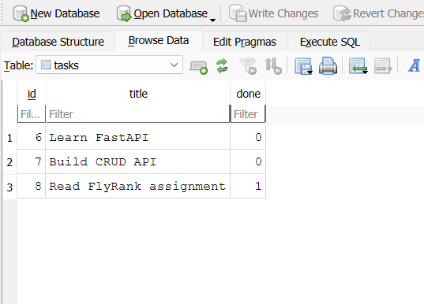

# FlyRank W3 A1 — Connecting CRUD API to SQLite

A CRUD API built with Python and FastAPI as part of the FlyRank AI Internship W3 A1 assignment.

The API manages a to-do task list using a SQLite database for persistent storage.

## Features

- Create tasks
- Read all tasks
- Read a single task
- Update tasks
- Delete tasks
- Input validation
- 400 error handling
- 404 error handling
- Swagger UI documentation
- SQLite database storage
- Persistent data across server restarts

## Tech Stack

- Python 3.10+
- FastAPI
- SQLite
- Uvicorn
- Pydantic

## Requirements

- Python 3.10+
- Git

## Installation

Clone the repository:

```bash
git clone https://github.com/arkankalevi/flyrank-crud-api
cd flyrank-crud-api
```

Create and activate a virtual environment:

```bash
python -m venv .venv
```

On Windows PowerShell:

```powershell
.venv\Scripts\Activate.ps1
```

Install the dependencies:

```bash
pip install -r requirements.txt
```

## Running the API

Start the FastAPI server:

```bash
uvicorn main:app --reload
```

The API will be available at:

```text
http://127.0.0.1:8000
```

Swagger UI is available at:

```text
http://127.0.0.1:8000/docs
```

## API Endpoints

| Method | Endpoint | Description |
|---|---|---|
| GET | `/` | Returns basic API information |
| GET | `/health` | Checks API health |
| GET | `/tasks` | Returns all tasks |
| GET | `/tasks/{id}` | Returns one task |
| POST | `/tasks` | Creates a new task |
| PUT | `/tasks/{id}` | Updates an existing task |
| DELETE | `/tasks/{id}` | Deletes a task |

## SQLite Database

This project uses SQLite as its database.

SQLite was chosen because it is lightweight, does not require a separate database server, and stores the database in a single file.

The database is automatically created when the application starts if it does not already exist.

## Database Location

The SQLite database file is:

```text
tasks.db
```

It is stored in the project root directory.

The `tasks.db` file is excluded from Git using `.gitignore`. When someone clones the repository and runs the application, the database and `tasks` table are automatically created.

## Database Schema

The database contains a table named `tasks`.

| Column | Type | Description |
|---|---|---|
| id | INTEGER | Primary key |
| title | TEXT | Task title |
| done | BOOLEAN | Completion status |

The table is automatically created with:

```sql
CREATE TABLE IF NOT EXISTS tasks (
    id INTEGER PRIMARY KEY AUTOINCREMENT,
    title TEXT NOT NULL,
    done BOOLEAN NOT NULL DEFAULT 0
);
```

## Database Viewer

The SQLite database can be inspected using DB Browser for SQLite.

The database contains the `tasks` table used by the API.



## Example SQL Query

One SQL query used to retrieve all tasks is:

```sql
SELECT * FROM tasks;
```

This query returns every row from the `tasks` table.

Another example is:

```sql
SELECT * FROM tasks WHERE done = 1;
```

This query returns only completed tasks.

## Persistence

Unlike the previous in-memory implementation, tasks are now stored in SQLite.

This means data survives when the FastAPI server is restarted.

The architecture is:

```text
Client
   ↓
FastAPI API
   ↓
database.py
   ↓
SQLite
   ↓
tasks.db
```

The API endpoints remain the same while the storage implementation has changed from in-memory data to a real database.